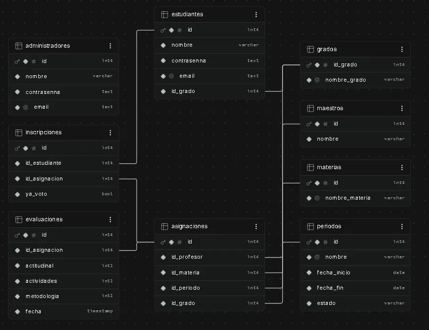

# Documento de Diseño — evaJav

Por: [nombres de los integrantes del grupo]

Video resumen: [pegar aquí la URL de YouTube]

## Alcance

evaJav es una plataforma web para que los estudiantes de un colegio evalúen de forma anónima el desempeño de sus profesores en cada materia que cursan. La base de datos que soporta esta plataforma incluye todo lo necesario para gestionar el ciclo completo de una votación institucional: quiénes pueden votar, qué se está votando, en qué ventana de tiempo, y los resultados agregados de esas votaciones. Concretamente, entran en el alcance de la base de datos:

- Estudiantes, incluyendo sus credenciales de acceso y el grado al que pertenecen.
- Administradores, usuarios con permisos para consultar resultados y abrir o cerrar periodos de votación.
- Profesores (maestros) y las materias que existen en el colegio.
- Periodos académicos, que delimitan cuándo está abierta o cerrada la votación.
- Asignaciones, que representan qué profesor dicta qué materia, a qué grado, en qué periodo.
- Inscripciones, que vinculan a un estudiante con las asignaciones que le corresponde evaluar, y controlan si ya emitió su voto.
- Evaluaciones, los votos anónimos en sí, con tres criterios cualitativos por evaluación.

Quedan fuera del alcance de esta primera versión: comentarios abiertos de texto por parte del estudiante, notificaciones por correo, historial de cambios de contraseña, y cualquier mecanismo de recuperación de identidad de una evaluación (esto último es una decisión de diseño deliberada, no una omisión).

## Requisitos Funcionales

Esta base de datos debe soportar:

- Registro y autenticación de estudiantes y administradores.
- Operaciones CRUD sobre profesores, materias, grados y periodos por parte de un administrador.
- Creación de asignaciones (profesor + materia + grado + periodo) y matrícula de estudiantes en ellas mediante inscripciones.
- Que un estudiante autenticado consulte únicamente las asignaciones que le corresponde evaluar y que aún no ha evaluado.
- Registro de una evaluación anónima por parte de un estudiante, sin que quede ningún rastro (ni siquiera interno) de qué estudiante la realizó.
- Control de que cada estudiante evalúe una única vez cada asignación en la que está inscrito.
- Consulta de resultados agregados (promedios por criterio) por parte de un administrador, filtrando por profesor, materia, grado o periodo.
- Apertura y cierre de periodos de votación, de forma que un profesor pueda cambiar de materia entre un periodo y otro sin perder el histórico de evaluaciones anteriores.

Cabe resaltar que, en esta iteración, el sistema no permite que un estudiante edite o retire un voto una vez emitido, ni que un administrador vea evaluaciones individuales — solo agregados. Esto es intencional: es la manera en que el esquema garantiza el anonimato.

## Representación

Las entidades se capturan en tablas de PostgreSQL con el siguiente esquema.

### Entidades

La base de datos incluye las siguientes entidades:

#### Grados

La tabla `grados` incluye:

- `id_grado`, identificador único como `integer` autogenerado (`GENERATED ALWAYS AS IDENTITY`). Tiene la restricción `PRIMARY KEY`.
- `nombre_grado`, el nombre corto del grado (por ejemplo `"11°"`) como `varchar(4)`, suficiente para nombres tan cortos. Tiene una restricción `UNIQUE` porque no puede haber dos grados con el mismo nombre.

#### Estudiantes

La tabla `estudiantes` incluye:

- `id`, identificador único, `PRIMARY KEY`.
- `nombre` como `varchar(60)`.
- `contrasenna`, almacenada como `text` porque contiene el *hash* de la contraseña (generado con bcrypt vía passlib en la aplicación), nunca la contraseña en texto plano. Un hash de bcrypt es de longitud fija, pero se usa `text` para no atarse a un tamaño específico de un algoritmo en particular.
- `email` como `text`, con restricción `UNIQUE` para que sirva como identificador de acceso.
- `id_grado`, `integer` con restricción `FOREIGN KEY` hacia `grados(id_grado)`, dado que todo estudiante pertenece a un único grado.

#### Administradores

La tabla `administradores` tiene una estructura casi idéntica a `estudiantes` (`id`, `nombre`, `contrasenna`, `email`), pero se modela como una entidad completamente separada y sin ninguna relación con el resto del esquema, porque representa un rol de sistema distinto (solo consulta y gestión), no un participante de las votaciones.

#### Maestros

La tabla `maestros` incluye únicamente `id` (`PRIMARY KEY`) y `nombre` (`varchar(60)`). No se modelaron credenciales de acceso para profesores porque, en el alcance actual, los profesores no inician sesión en la plataforma.

#### Materias

La tabla `materias` incluye `id` (`PRIMARY KEY`) y `nombre_materia` (`varchar(60)`, con restricción `UNIQUE`).

#### Periodos

La tabla `periodos` incluye:

- `id`, `PRIMARY KEY`.
- `nombre` como `varchar(20)` (por ejemplo `"2026-2"`), con restricción `UNIQUE`.
- `fecha_inicio` y `fecha_fin` como `date`.
- `estado` como `varchar(10)`, restringido por un `CHECK` a los valores `'abierto'` o `'cerrado'`, con valor por defecto `'cerrado'`. Se modeló como una columna de texto controlada por `CHECK` en vez de un tipo `boolean` (`abierto`/`no abierto`) porque deja espacio para agregar un tercer estado en el futuro (por ejemplo `'archivado'`) sin migrar el tipo de dato.
- Un `CHECK` adicional garantiza que `fecha_fin >= fecha_inicio`.

#### Asignaciones

La tabla `asignaciones` es la entidad puente central del esquema: representa que un profesor dicta una materia a un grado específico dentro de un periodo específico. Incluye:

- `id`, `PRIMARY KEY`.
- `id_profesor`, `id_materia`, `id_periodo`, `id_grado`, todas como `FOREIGN KEY` hacia sus respectivas tablas.
- Una restricción `UNIQUE` compuesta sobre `(id_profesor, id_materia, id_grado, id_periodo)` impide registrar la misma combinación dos veces, pero sí permite que un mismo profesor dicte la misma materia a grados distintos, o cambie de materia entre periodos.

Se crearon índices sobre las cuatro columnas `FOREIGN KEY` de esta tabla porque PostgreSQL no los crea automáticamente, y son la base de casi todos los `JOIN` que ejecuta la aplicación.

#### Inscripciones

La tabla `inscripciones` vincula a un estudiante con una asignación que le corresponde evaluar:

- `id`, `PRIMARY KEY`.
- `id_estudiante` e `id_asignacion`, `FOREIGN KEY` hacia `estudiantes` y `asignaciones` respectivamente.
- `ya_voto`, `boolean NOT NULL DEFAULT false`. Esta columna es la que impide que un estudiante vote dos veces por la misma asignación, sin que la tabla de evaluaciones necesite saber quién es ese estudiante.
- Una restricción `UNIQUE` sobre `(id_estudiante, id_asignacion)` impide inscripciones duplicadas.

#### Evaluaciones

La tabla `evaluaciones` almacena los votos anónimos:

- `id`, `PRIMARY KEY`.
- `id_asignacion`, `FOREIGN KEY` hacia `asignaciones`. **Esta es la única relación que tiene la tabla.** No existe, en ninguna parte del esquema, una columna que conecte una fila de `evaluaciones` con una fila de `estudiantes`.
- `actitudinal`, `actividades` y `metodologia`, cada una `smallint` con un `CHECK` que restringe su valor al rango 1–3 (1 = Malo, 2 = Bien, 3 = Excelente). Se modelaron como tres columnas fijas, en vez de una tabla normalizada de "criterios", porque el conjunto de criterios es fijo y conocido de antemano — no se espera que cambie con frecuencia, y una tabla adicional solo añadiría un `JOIN` innecesario a cada consulta de resultados.
- `fecha`, `timestamp NOT NULL DEFAULT now()`.

### Relaciones

El diagrama entidad-relación a continuación describe las relaciones entre las entidades:

Como se detalla en el diagrama:

- Un grado tiene de 0 a muchos estudiantes; un estudiante pertenece a uno y solo un grado.
- Un profesor puede tener de 0 a muchas asignaciones (puede no estar dictando nada en un periodo, o dictar varias); una asignación pertenece a uno y solo un profesor. Lo mismo aplica para la relación de `materias` y `grados` con `asignaciones`.
- Un periodo puede tener de 0 a muchas asignaciones asociadas; una asignación pertenece a uno y solo un periodo.
- Un estudiante puede tener de 0 a muchas inscripciones; una inscripción pertenece a uno y solo un estudiante. De igual forma, una asignación puede tener de 0 a muchas inscripciones (los estudiantes matriculados en ella), y cada inscripción pertenece a una y solo una asignación.
- Una asignación puede tener de 0 a muchas evaluaciones (0 si aún nadie ha votado); cada evaluación pertenece a una y solo una asignación. **No existe ninguna relación entre `evaluaciones` y `estudiantes`** — esta ausencia deliberada de una llave foránea es el mecanismo con el que el esquema garantiza el anonimato del voto a nivel estructural, no solo a nivel de aplicación.
- `administradores` no participa en ninguna relación con el resto de las tablas: es un rol de acceso independiente, no una entidad del dominio de las votaciones.

## Optimizaciones

Según las consultas típicas descritas en `queries.sql`, el flujo más frecuente del lado del estudiante es "listar las asignaciones que un estudiante en particular todavía no ha evaluado en el periodo abierto", lo que siempre filtra por `id_estudiante`. Por eso se creó un índice sobre `id_estudiante` en `inscripciones`. De forma similar, resolver "quién dicta esta asignación" requiere resolver las cuatro llaves foráneas de `asignaciones` constantemente, así que se indexaron las cuatro (`id_profesor`, `id_materia`, `id_periodo`, `id_grado`).

Del lado del administrador, la consulta más frecuente es obtener el promedio de cada criterio por cada asignación, con los nombres de profesor, materia, grado y periodo ya resueltos — el panel de resultados la ejecuta cada vez que se carga. En vez de repetir ese `JOIN` de cinco tablas más `AVG`/`GROUP BY` en cada endpoint de la aplicación, se dejó resuelta en la vista `resultados_por_asignacion` (ver `schema.sql`), que además usa `LEFT JOIN` para que las asignaciones sin evaluaciones todavía aparezcan con cero votos en vez de desaparecer del resultado.

## Limitaciones

El esquema actual asume que cada estudiante pertenece a un único grado por periodo académico; no soporta estudiantes que repiten o cursan materias de más de un grado simultáneamente. Tampoco soporta evaluaciones parciales o borradores: una evaluación se inserta completa o no se inserta.

La garantía de anonimato tiene un límite conocido: si una asignación tiene muy pocos estudiantes inscritos (por ejemplo, uno solo), un administrador podría inferir indirectamente el contenido del voto aunque el esquema no lo vincule explícitamente. Mitigar esto (por ejemplo, exigiendo un mínimo de inscritos antes de mostrar resultados) queda fuera del alcance de la base de datos y tendría que resolverse en la capa de aplicación.

Finalmente, el esquema no guarda un historial de cambios sobre `maestros`, `materias` o `grados`: si se corrige el nombre de un profesor, se pierde el nombre anterior. Para el alcance de este proyecto se consideró un costo aceptable frente a la complejidad de una tabla de auditoría.